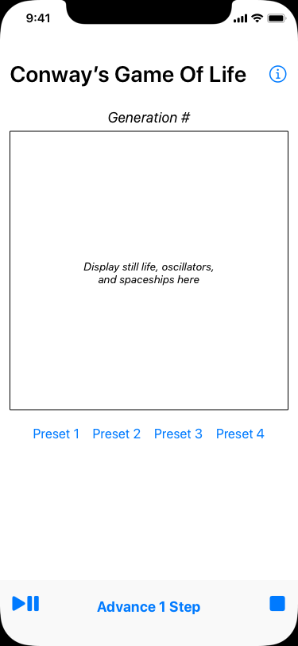
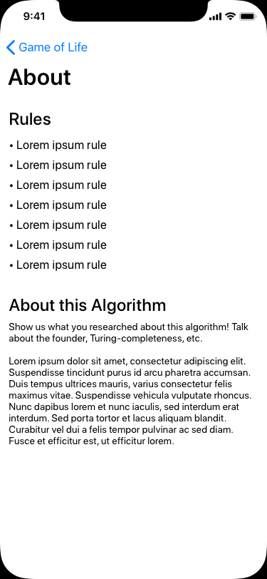
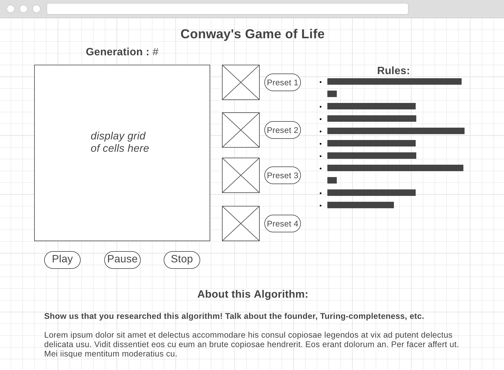

# Cellular Automata and Conway's "Game of Life"

---

**NOTE: This is not a data science project.** If you're in the data
science track and want to do a DS-specific project, jump to the [Data
Science Build Week
Repo](https://github.com/LambdaSchool/CS-Data-Science-Build-Week-1).

---

Welcome to John Conway's "Game of Life"! This is a computer science
classic from 1970, a program that simulates a _cellular automaton_
(plural _automata_). It has connections to all kinds of different
aspects of computer science and nature.

Over the course of this week, students will work on creating their own
application in which users will be able to run different "Game of Life"
scenarios. This module leads the reader through the fundamentals of
Conways's "Game of Life" and will guide them through the process of
creating an app utilizing tools and frameworks that have been taught
over the course of their specific track.

[from Wikipedia](https://en.wikipedia.org/wiki/Conway%27s_Game_of_Life#Examples_of_patterns)

## Collaboration

This is a solo project, not a team project. Each person will be expected
to make their own repo and do their own coding.

That said, we _encourage_ cooperation during the Understand, Plan, and
Reflect phases of UPER. It's the Execution that everyone will have to do
their own work for.

This doesn't mean you can't ask for help during coding. Definitely feel
free to reach out. But there won't be any pair programming or splitting
the project into different chunks for different people.

## Clone this repo?

Or start from scratch?

Recommend starting from scratch. That way you'll have a clean commit
history and won't have to worry about merging changes from this
informational repo in yours.

## Objectives

* Student should be able to create a unique, high-quality project that
  can be added to a professional portfolio
* [Student should be able to describe the rules of Conway’s “Game of
  Life”](objectives/rules-game-life)
* [Student should be able to explain what cellular automata are and
  describe how they are useful in real
  life](objectives/explain-describe-ca)
* [Student should be able to correctly analyze the ‘Turing Completeness’
  of Conway’s “Game of Life”](objectives/turing-complete)
* Student should be able to implement a visualization of Conway’s “Game
  of Life” using technologies related to their specific
  track.
* [Student should be able to utilize "double buffering" to implement
  the game](objectives/double-buffer)

## MVP Features

### Preliminary Work

* Research Conway’s "Game of Life". Figure out how it works, why it’s
  useful, and how the notion of Turing Completeness is related to this
  topic.

### Building Your App

#### Visualizing the "Game of Life"

The main entry point of your application should house the visualization
of this cellular automaton. Include necessary components, such as:

* Grid to display cells. 
* Cell objects or components that, at a minimum, should have:
  * Properties
    * current state: (alive, dead), (black, white)
    * Clickable/Tappable:
      * can be clicked to allow user to setup initial cell configuration
      * should NOT be clickable while simulation is running
    * Behaviors
      * Toggle state functionality: switch between alive & dead either
        because user manually toggled cell before starting simulation or
        simulation is running and rules of life caused cell to change
        state
* An appropriate data structure to hold a grid of cells that is at least
  25x25. Go as big as you want.
* Text to display current generation # being displayed
  * Utilize a timeout function to build the next generation of cells &
    update the display at the chosen time interval
* Button(s) that start & stop the animation
* Button to clear the grid

Write an algorithm that:

* Implements the following basic steps:
  * For each cell in the current generation's grid:
    1. Examine state of all eight neighbors (it's up to you whether you
       want cells to wrap around the grid and consider cells on the
       other side or not)
    2. Apply rules of life to determine if this cell will change states
    3. When main loop completes:
       1. Swap current and next grids
       2. Repeat until simulation stopped
* Breaks down above steps into appropriate sub-tasks implemented with
  helper functions to improve readability
* Uses double buffering to update grid with next generation.
* Does something well-documented with the edge of the grid. (e.g. wrap
  around to the far side--most fun!--or assumes all edge cells are
  permanently dead.)

### Custom Features

Implement at least 3 of the following features:

* Create a few sample cell configurations that users can load and run
* Add an option that creates a random cell configuration that users can
  run
* Add additional cell properties, like color or size, and incorporate
  them into your visualization
* Allow users to specify the speed of the simulation
* Provide functionality to manually step through the simulation one
  generation at a time, as opposed to animating automatically
* Allow users to change the dimension of the grid being displayed
* Given a specific generation, calculate the configuration of cells at
  that point in time, and jump to that state, bypassing animation (i.e.
  skip ahead _n_ generations).
* If you have an idea for a custom feature on this list, run it by your
  TL or instructor

#### About

* On the main entry point of the application, include a separate section
  or link to another page or popup that describes the two main rules
  (birth & death) of Conway’s Game of Life

## Stretch Goals

* Implement 2+ additional custom features, above
* Deploy your app to a hosting service or, for iOS, to TestFlight (or
  the App Store!). Web devs can see [more deployment info
  here](resources/web/deployment).
* Write a how-to guide or blog post that walks readers through the
  work you did to implement your project
* Expand your simulation into the third dimension. Google `3D Conways
  Life`. Google for how to do 3D stuff on your platform. Web users might
  check out [3D-ThreeJS](https://github.com/LambdaSchool/3D-ThreeJS),
  and iOS might look at [SceneKit](https://developer.apple.com/scenekit/).
* Explore alternate algorithms for finding the nth generation, such
  as [Hashlife](https://en.wikipedia.org/wiki/Hashlife)

## Sample Wireframe

Example wireframes here. _This is only one possible layout. You can use
any layout you come up with, as long as it completes MVP._

We encourage you to be creative with your presentation and make it your
own.

### Mobile

iOS example, could also inspire mobile web.

### Desktop/Tablet

## Code and Repo Quality

Though this is not currently a requirement, it is a strong suggestion.

### Code

* Make your code look sharp and professional if you think anyone will
  see it.
  * Comments that say what part of the problem a function or block of
    code solves.
    * Only comment on what a single line does if that single line is
      unclear.
  * Blank lines to visually break up logical sections of code, analogous
    to paragraph breaks.

### Repo

* Well-organized directories.
* Good file names that let a reader quickly determine which file is
  where.
* Good `README.md` files that help the reader with code navigation and
  installation.
  * What is the project?
  * What problem does it solve?
  * Exceptional difficulties and solutions, if any.
  * TODO list/wishlist. What do you want to add to it if you have more
    time?

## Rubric

**Your simulation will receive a 2 when it satisfies the following:**

   1. Display includes a text area that shows the current generation of
      cells being displayed
   2. Display includes a grid of cells, at least 25x25, that can be
      toggled to be _alive_ or _dead_
   3. Display includes working buttons that start / stop the animation
      and clear the grid
   4. Algorithm to generate new generations of cells correctly
      implemented
   5. At least 3 features from ***Custom Features*** section
      successfully implemented
   6. Application includes a section outlining the rules to Conway's
      "Game of Life"

**Your simulation will receive a 3 when it satisfies all of the above
requirements AND implements one of the above stretch goals.**

## Track-Specific Help

Channels for help that's about your specific technologies, if the TLs
and/or instructor doesn't have enough knowledge in that area.

* DS: Your cohort channel
* iOS: #ios_help
* Web: Your cohort channel

## Additional Resources

For various platforms:

* [Resources](resources/)
