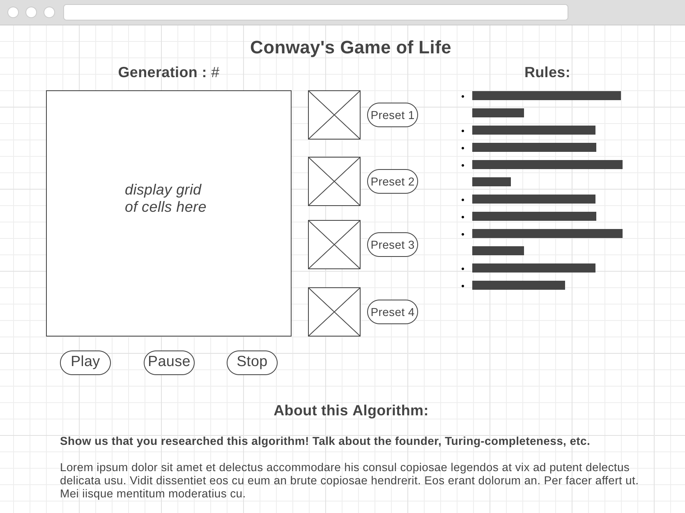

# Cellular Automata and Conway's "Game of Life"

Over the course of this week, students will work on creating their own application in which users will be able to run different "Game of Life" scenarios. This module leads the reader through the fundamentals of Conways's "Game of Life" and will guide them through the process of creating an app utilizing tools and frameworks that have been taught over the course of their specific track.

[from Wikipedia](https://en.wikipedia.org/wiki/Conway%27s_Game_of_Life#Examples_of_patterns)

## Objectives
* Student should be able to create a unique, high-quality project that can be added to a professional portfolio
* [Student should be able to describe the rules of Conway’s “Game of Life”](objectives/rules-game-life)
* [Student should be able to explain what cellular automata are and describe how they are useful in real life](objectives/explain-describe-ca)
* [Student should be able to correctly analyze the ‘Turing Completeness’ of Conway’s “Game of Life”](objectives/turing-complete)
* [Student should be able to implement a visualization of Conway’s “Game of Life” using technologies related to their specific track](objectives/visualization)
* [Student should be able to utilize “double buffering” to implement animations](objectives/double-buffer)

## Git Commits

- You are required to showcase progress with at least 1 commit a day.
  This will let your project manager know where you are and if you need
  help. This also allows the client to get progress reports from the
  company in a real world setting.

## Trello Set Up:

- [ ] Create a Trello account if you don't have one already
- [ ] Create a new board called "GameOfLife - {Your Name}"
- [ ] Create lists titled `backlog`,`To Do`, `In Progress`, and `Done`
- [ ] Fill in the `To Do` list with the MVP features listed below
- [ ] Fill in the `backlog` list with all the extra features listed below
- [ ] Share your board with the project manager that has been assigned to you. If you have not been assigned yet, reach out to your lead PM for guidance
- [ ] Add your Trello URL to your project's README.md file. Commit the change, push it to your repository & submit a pull request

## MVP Features:

### Preliminary Work
- [ ] Research Conway’s “Game of Life”. Figure out how it works, why it’s useful, and how the notion of Turing Completeness is related to this topic.

### Building Your App

#### Visualizing the “Game of Life”
The main entry point of your application should house the visualization of this cellular automata. Include necessary components, such as:
- [ ] Grid to display cells. 
- [ ] Cell objects or components that, at a minimum, should have:
    * Properties
        - [ ] currentState: (alive, dead), (black, white)
        - [ ] isClickable:
          - can be clicked to allow user to setup initial cell configuration 
          - should NOT be clickable while simulation is running
    * Behaviors
        - [ ] toggle_state( ): switch between alive & dead either because user manually toggled cell before starting simulation or simulation is running and rules of life caused cell to change state
- [ ] An appropriate data structure to hold a grid of cells that is at least 15 X 15. 
- [ ] Text to display current generation # being displayed
    * Utilize a timeout function to build the next generation of cells & update the display at the chosen time interval     
- [ ] Button(s) that start & stop the animation
- [ ] Button to clear the grid

Write an algorithm that:    
- [ ] Implements the following basic steps:
    - For each cell in the current generation's grid:
      1. Examine state of all eight neighbors (it's up to you whether you want cells to wrap around the grid and consider cells on the other side or not)
      2.  Apply rules of life to determine if this cell will change states
    - When loop completes:
      1. Swap current and next grids
      2. Repeat until simulation stopped
- [ ] Breaks down above steps into appropriate sub-tasks implemented with helper functions to improve readability
- [ ] Uses double buffering to update grid with next generation.

### Custom Features
Implment at least 3 of the following features:
- [ ] Create a few sample cell configurations that users can load and run 
- [ ] Add an option that creates a random cell configuration that users can run
- [ ] Add additional cell properties, like color or size, and incorporate them into your visualization
- [ ] Allow users to specify the speed of the simulation
- [ ] Provide functionality to manually step through the simulation one generation at a time, as opposed to animating automatically
- [ ] Allow users to change the dimension of the grid being displayed
- [ ] Given a specific generation, calculate the configuration of cells at that point in time, and jump to that state, bypassing animation
- [ ] If you have an idea for a custom feature on this list, run it by your PM or instructor

#### Rules 
- [ ] On the main entry point of the application, include a separate section or link to another page / screen that describes the two main rules (birth & death) of Conway’s “Game of Life”

#### About this Algorithm
- [ ]  On the main entry point of the application, include a separate section or link to another page / screen that describes more about Conway’s “Game of Life”, such as whether or not it is Turing Complete or the history of this cellular automaton

### Deployment
- [ ] Deploy your app using a tool like [GitHub Pages or Heroku](resources/deployment)

## Stretch Goals
- [ ] Write a how-to guide or blog post that walks readers through the work you did to implement your project
- [ ] Expand your simulation into the third dimension - [check out 3D-ThreeJS](https://github.com/LambdaSchool/3D-ThreeJS)
- [ ] Explore alternate algorithms for finding the nth generation, such as [Hashlife](https://en.wikipedia.org/wiki/Hashlife)

## Sample Wireframe

## Rubric

#### Your simulation will receive a 2 when it satisfies the following:
   1. Display includes a text area that shows the current generation of cells being displayed
   2. Display includes a grid of cells, at least 15 x 15, that can be toggled to be _alive_ or _dead_
   3. Display includes working buttons that start / stop the animation and clear the grid
   4. Algorithm to generate new generations of cells correctly implemented
   5. Display is updated seamlessly using double buffering
   6. At least 3 features from ***Custom Features*** section successfully implemented
   7. Application includes a section outlining the rules to Conway's "Game of Life" 
   8. Application includes a section that describes history of / technical details related to Conway's "Game of Life"
   9. Application is successfully deployed
   

#### Your simulation will receive a 3 when it satisfies all of the above requirements AND implements one of the following stretech goals:
   * Write a how-to guide or blog post that walks readers through the work you did to implement your project
   * Expand your simulation into the third dimension - [check out 3D-ThreeJS](https://github.com/LambdaSchool/3D-ThreeJS)
   * Explore alternate algorithms for finding the nth generation, such as [Hashlife](https://en.wikipedia.org/wiki/Hashlife)
